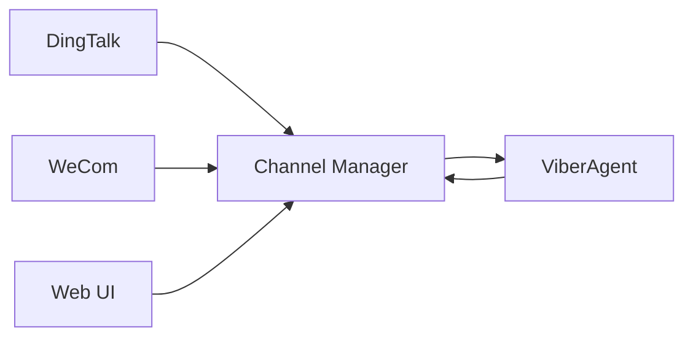

import { Aside, Tabs, TabItem } from '@astrojs/starlight/components';

## Overview

**Channels** bridge Viber agents to external command centers—chat apps, web UIs, and APIs. They handle inbound messages and stream responses back.



## Built-in Channels

| Channel | Type | Use Case |
|---------|------|----------|
| `dingtalk` | Webhook | Enterprise chat (China) |
| `wecom` | Webhook | WeChat Work integration |
| `web` | WebSocket | Browser-based UI |

## Configuration

Channels are configured in the data adapter:

```typescript
const config: ChannelsConfig = {
  dingtalk: {
    enabled: true,
    appKey: "...",
    appSecret: "...",
  },
  wecom: {
    enabled: true,
    corpId: "...",
    agentId: "...",
    secret: "...",
    token: "...",
    aesKey: "...",
  },
  web: {
    enabled: true,
  },
};
```

## Message Flow

```typescript
interface InboundMessage {
  id: string;           // Unique message ID
  source: string;       // Channel ID (dingtalk, wecom, web)
  userId: string;       // Platform user ID
  conversationId: string;
  content: string;
  attachments?: Attachment[];
  metadata?: Record<string, any>;
}
```

1. **Inbound**: Channel receives message → passes to ViberAgent
2. **Processing**: Agent generates response (streaming)  
3. **Outbound**: Channel streams response back to platform

## Event Streaming

Channels emit typed events:

```typescript
type AgentStreamEvent =
  | { type: "text-delta"; content: string }
  | { type: "tool-call"; tool: string; args: unknown }
  | { type: "tool-result"; tool: string; result: unknown }
  | { type: "error"; error: string }
  | { type: "done" };
```

<Aside type="tip">
Unlike centralized webhook servers, Viber channels connect **outbound** from the local daemon to command centers, eliminating the need for public IPs or port forwarding.
</Aside>

## Channel Manager

The `ChannelManager` orchestrates multiple channels:

```typescript
import { ChannelManager } from "@dustland/viber";

const manager = new ChannelManager(config);
await manager.startAll();

// Graceful shutdown
await manager.stopAll();
```
