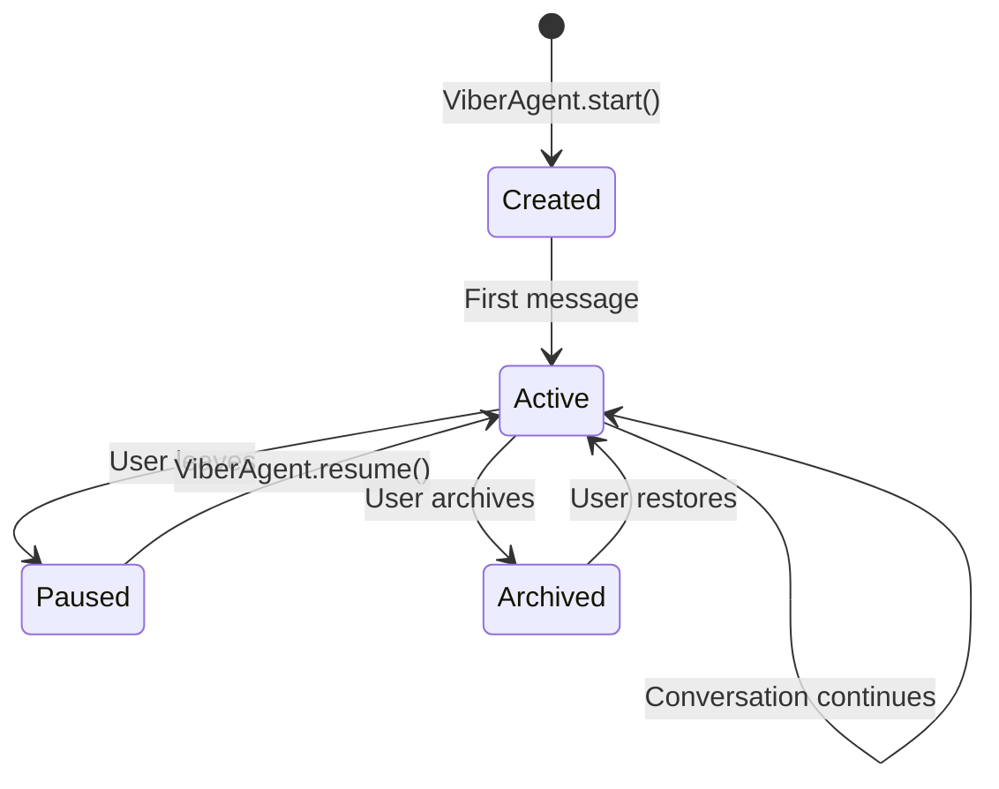
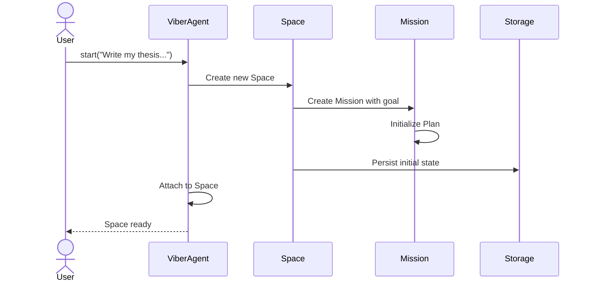
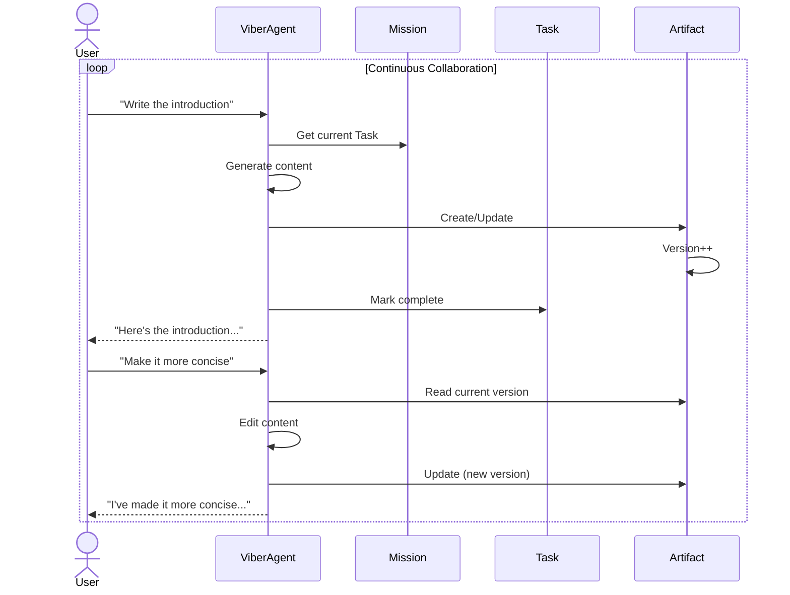
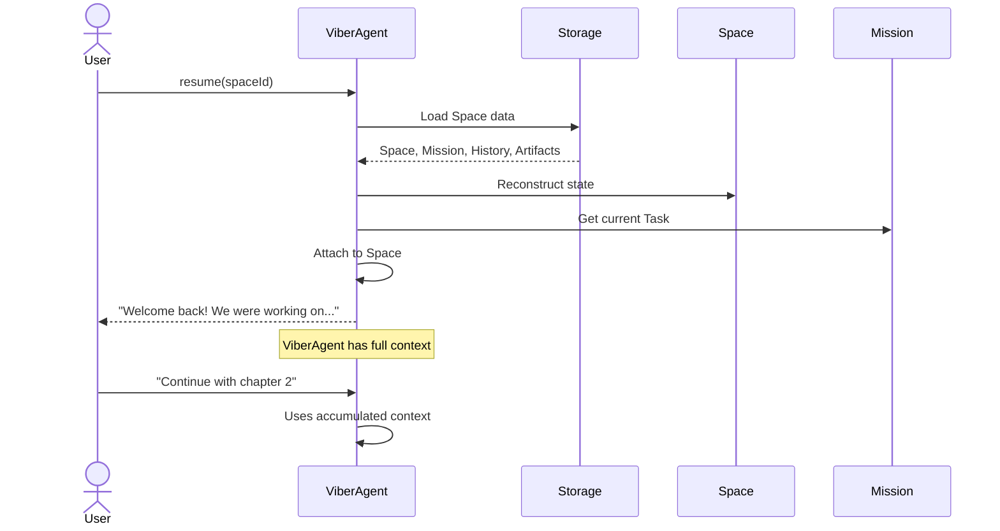
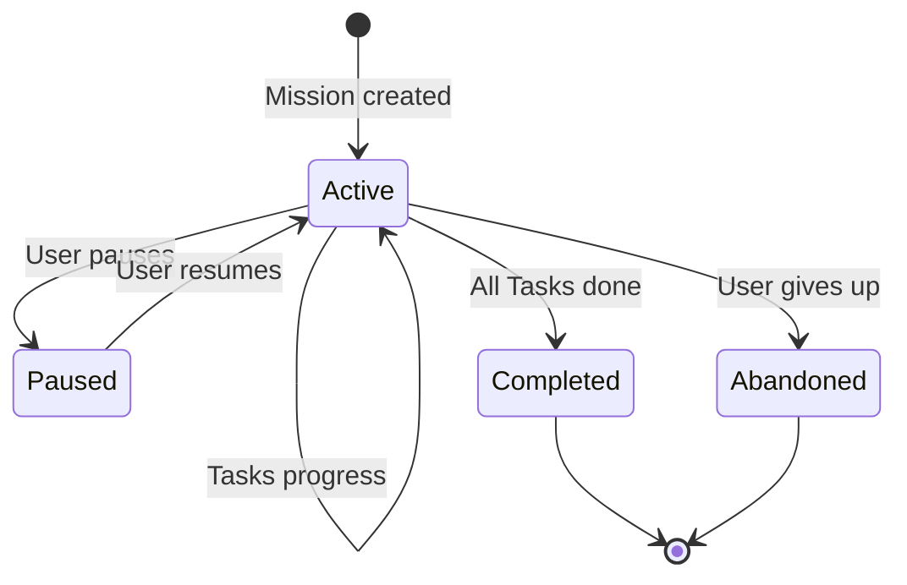
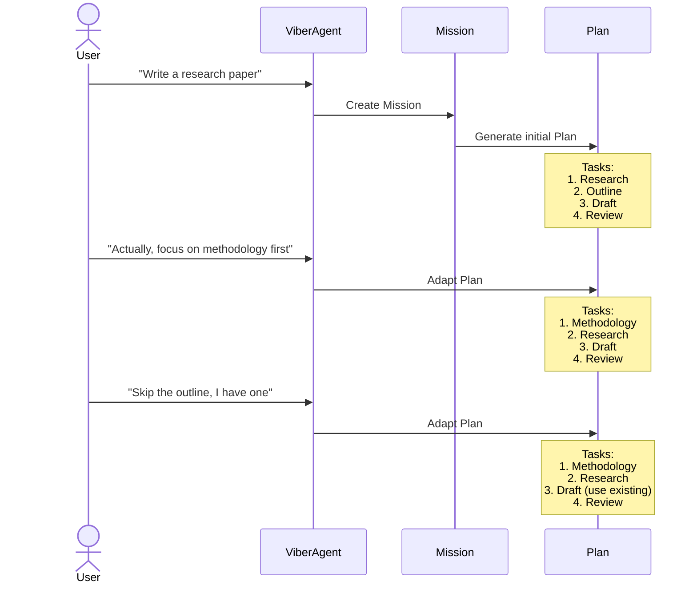
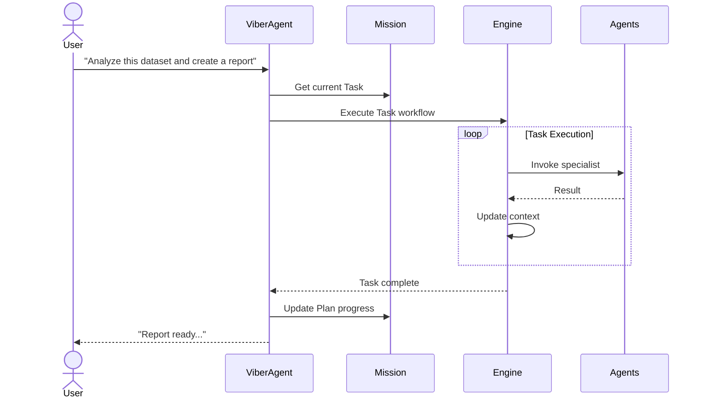

Unlike task-oriented frameworks with a simple "start → execute → end" lifecycle, Viber provides **persistent Spaces** where work evolves over time through continuous collaboration.

## Core Concepts Hierarchy

```
Space (persistent container)
  └── Mission (user's substantial intent)
        └── Plan (strategy, evolves)
              └── Task[] (individual work items)
```

- **Space**: A persistent container that never ends—like a project folder
- **Mission**: A substantial goal with a lifecycle (e.g., "Write my thesis")
- **Plan**: The strategy for achieving a Mission, can evolve
- **Task**: Individual work items within a Plan

> **Note**: Our "Task" is different from AI SDK's "steps" (multi-turn tool execution loops). Viber Tasks are higher-level work items.

## Understanding Spaces vs Missions

A **Space** is a persistent container—it doesn't have a lifecycle with start/end. Think of it like a project workspace that always exists once created.

A **Mission** within a Space has a lifecycle: it's created, worked on, and eventually completed or abandoned. Missions represent substantial goals that require multiple Tasks.

## Session States (Not Space Lifecycle)

While Spaces persist indefinitely, **user sessions** within a Space have states:



Note: These are **session states**, not Space states. The Space itself persists through all of these—only the user's active connection changes.

## Phase 1: Mission Creation

When a user starts a new project, ViberAgent creates a Space and begins the first Mission:

```typescript
// User initiates
const space = await ViberAgent.start("Write my thesis on climate change");
// Creates: Space + Mission("Write my thesis on climate change")
```

What happens internally:



**Created State:**

- Empty artifact list
- Fresh conversation history
- Mission with initial Plan
- ViberAgent attached and ready

## Phase 2: Active Collaboration

The core of Viber—continuous iteration on artifacts through conversation.

### The Conversation-Artifact Loop



### Artifact Versioning

Every modification creates a new version:

```typescript
interface ArtifactVersion {
  version: number;
  content: Buffer | string;
  createdAt: Date;
  createdBy: string; // Agent or user
  message?: string; // Commit message
  relatedMessageId?: string; // The message that triggered this change
}
```

Example evolution:

```
thesis.md
├── v1: Initial draft (by ViberAgent, "Write the introduction")
├── v2: More concise (by ViberAgent, "Make it more concise")
├── v3: Added citations (by Researcher agent)
└── v4: Final polish (by Editor agent)
```

## Phase 3: Session Pause & Resume

Users can leave and return at any time. The Space preserves everything.

### Leaving a Session

When the user closes the browser or explicitly pauses:

```typescript
// Automatic on disconnect, or explicit
await space.pause();
```

What's preserved:

- Complete conversation history
- All artifact versions
- Current Mission and Plan state
- Agent configurations
- User preferences

### Resuming a Session

```typescript
// Next day, next week, next month...
const space = await ViberAgent.resume("space_abc123");
```

What happens:



## Mission Lifecycle States



## Artifact Evolution Patterns

### Pattern 1: Single Document Refinement

```typescript
// Session 1: Draft
await xAgent.chat("Write a blog post about AI");
// Creates: blog-post.md v1

// Session 2: Improve
await xAgent.chat("Add more technical details");
// Updates: blog-post.md v2

// Session 3: Polish
await xAgent.chat("Make it more engaging");
// Updates: blog-post.md v3
```

### Pattern 2: Multi-Artifact Project

```typescript
// Session 1: Research
await xAgent.chat("Research renewable energy trends");
// Creates: sources.md, notes.md

// Session 2: Outline
await xAgent.chat("Create an outline for a report");
// Creates: outline.md
// References: sources.md, notes.md

// Session 3: Write
await xAgent.chat("Write the full report");
// Creates: report.md
// Uses: outline.md, sources.md, notes.md
```

### Pattern 3: Collaborative Editing

```typescript
// User uploads existing document
await space.uploadArtifact("proposal.docx", content);

// Iterative refinement
await xAgent.chat("Review and suggest improvements");
// ViberAgent reads proposal.docx, provides feedback

await xAgent.chat("Apply the suggestions");
// Updates: proposal.docx v2

await xAgent.chat("Now focus on the budget section");
// Updates: proposal.docx v3
```

## Plan Adaptation

Unlike static workflows, Viber Plans adapt based on conversation:



## Context Accumulation

A key feature of Space-oriented design is **context accumulation**:

```typescript
// Traditional: Each call is independent
agent.run("Research X"); // Context: just "Research X"
agent.run("Write about X"); // Context: just "Write about X"

// Viber: Context accumulates
await xAgent.chat("Research climate change");
// Context: research request

await xAgent.chat("Focus on agriculture impacts");
// Context: research + agriculture focus

await xAgent.chat("Write a summary");
// Context: research + agriculture + all findings
// ViberAgent knows everything discussed
```

### Context Window Management

For long-running Spaces, context is managed intelligently:

```typescript
interface ContextManager {
  // Get relevant context for current request
  getRelevantContext(
    query: string,
    tokenLimit: number
  ): Promise<XMessage[]>;

  // Summarize old context
  summarizeOldMessages(): Promise<void>;

  // Retrieve by artifact
  getContextForArtifact(artifactId: string): XMessage[];
}
```

## Execution Engine Integration

For complex multi-step operations, ViberAgent can invoke the internal Execution Engine:



### Human-in-the-Loop

Execution can pause for user input:

```typescript
// Execution node
{
  type: "human_input",
  prompt: "Please review this draft and provide feedback",
  artifactId: "draft.md"
}
```

When reached:

1. Engine pauses
2. User notified
3. User provides feedback
4. Engine resumes with feedback in context

## Space Archival

When a project is complete:

```typescript
await space.archive();
```

Archived Spaces:

- Remain fully accessible
- Can be restored to active state
- Serve as reference for future work
- Can be cloned as templates

## Summary: The Viber Model

```
┌─────────────────────────────────────────────────────────────┐
│                    PERSISTENT SPACE                         │
├─────────────────────────────────────────────────────────────┤
│                                                             │
│  MISSIONS:  Mission1 ──► Mission2 ──► ...                  │
│                │                                            │
│                ▼                                            │
│         ┌──────────┐                                        │
│         │   Plan   │                                        │
│         │ ┌──────┐ │                                        │
│         │ │Task 1│ │                                        │
│         │ │Task 2│ │                                        │
│         │ │Task 3│ │                                        │
│         │ └──────┘ │                                        │
│         └──────────┘                                        │
│                │                                            │
│                ▼                                            │
│    ┌──────────────────────────────────┐                     │
│    │          Artifacts               │                     │
│    │   v1 → v2 → v3 → v4 → ...       │                     │
│    │   (evolve across missions)       │                     │
│    └──────────────────────────────────┘                     │
│                      │                                      │
│                      ▼                                      │
│    ┌──────────────────────────────────┐                     │
│    │          History                 │                     │
│    │   (persisted across sessions)    │                     │
│    └──────────────────────────────────┘                     │
│                                                             │
│  SESSIONS:  Connect ──► Work ──► Disconnect ──► Reconnect  │
│             (Space persists through all sessions)           │
│                                                             │
└─────────────────────────────────────────────────────────────┘
```

**Key Insights:**

- **Spaces persist forever** - Your workspace is always there
- **Missions have lifecycles** - Substantial goals that can be completed
- **Plans evolve** - Strategy adapts based on feedback
- **Tasks are work items** - Individual steps within a Plan
- **Artifacts evolve** - Content improves over time
- **Context is never lost** - Everything is preserved
